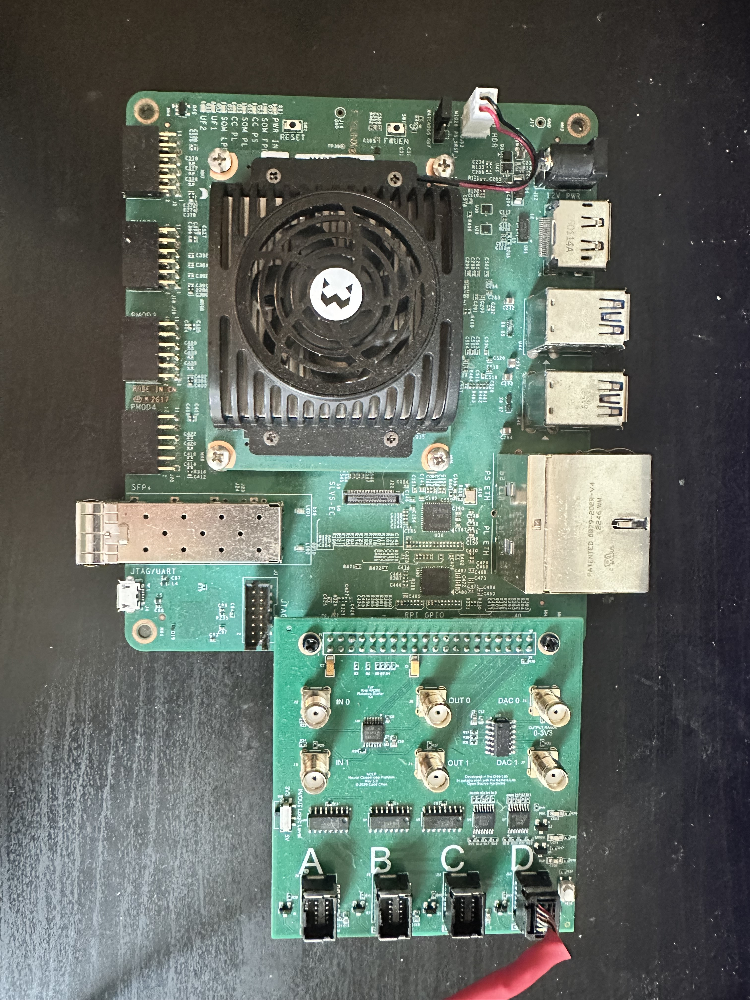
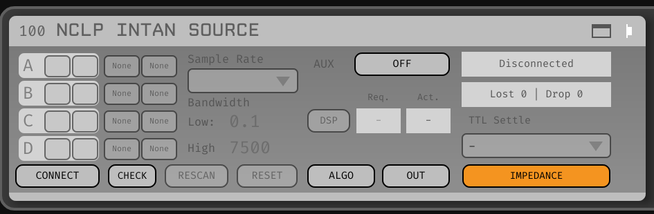
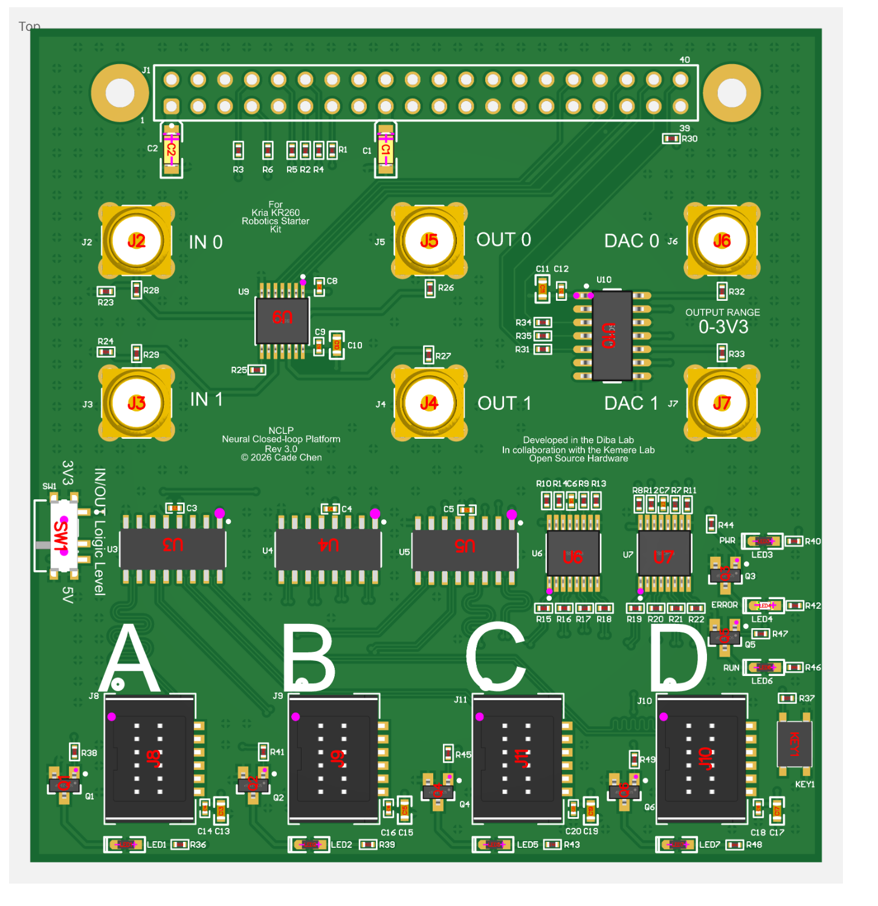
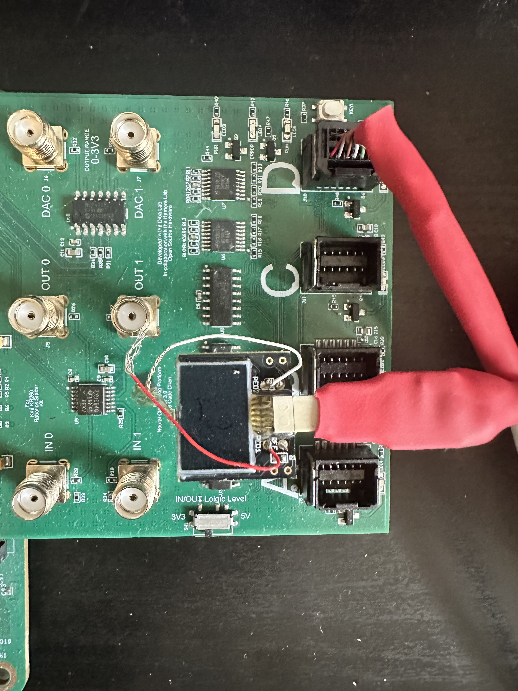

# Neural Closed-Loop Platform (NCLP)



NCLP is a neural data-acquisition and synchronization module for the AMD Kria
KR260. It coordinates data across the system, runs lightweight FPGA algorithms
for low-latency stimulation, and currently includes a ripple detector. It can
also stream data over SFP+ to another Xilinx FPGA for additional processing.

| Feature | Parameter |
| --- | --- |
| FPGA | AMD Kria KR260/K26 (`xck26-sfvc784-2LV-c`) |
| Acquisition | Intan RHD; 5, 10, 15, 20, 25, or 30 kS/s |
| Digital I/O | 2 TTL inputs and 2 TTL outputs |
| Analog output | 2-channel, 12-bit DAC |
| SFP+ | Aurora 64B/66B at 10.3125 Gb/s |
| Tools | Vivado and Vitis 2025.1 |

## Build

```bash
python3 scripts/build_ripple_hls.py
vivado -mode batch -source scripts/create_project.tcl
vivado -mode batch -source scripts/build_bitstream_export_once.tcl
vitis -s scripts/create_vitis_platform.py
vitis -s scripts/create_vitis_main.py
(cd vitis_project/main && bootgen -arch zynqmp -image boot.bif -o BOOT.bin -w on)
```

## Latency

Latency is the physical TTL time minus the detector's causal threshold-crossing
time. The fixed-cycle FPGA path provides deterministic low latency without
software scheduling jitter.

| System | Reported latency | Measurement |
| --- | ---: | --- |
| NCLP FPGA (theoretical) | 1.23 µs | Causal detector sample to TTL; fixed 123 clocks with 0-cycle RTL jitter |
| NCLP Intan TTL loopback, 100 trials | One 33.3 µs sample bin | Ideal replay decision to returned TTL; 100/100 in the same bin |
| [Dutta, Ackermann, and Kemere (2019)](https://doi.org/10.1088/1741-2552/aae90e), Intan + SpikeGadgets Ethernet | 1.35–2.60 ms for 80% of trials | Ideal simulated detection to online looped-back trigger |
| [Dutta, Ackermann, and Kemere (2019)](https://doi.org/10.1088/1741-2552/aae90e), Intan + Open Ephys USB | 7.5–13.8 ms for 80% of trials | Same method |
| [SpikesPeak](https://neuralascension.com/spikespeak/develop/RecordingTests/CLOSED_LOOP_LATENCY.html), Neuropixels 2.0 ASAP | 0.546–0.608 ms median | Online threshold to physical stimulation; p95: 0.66–0.72 ms |
| [SpikesPeak](https://neuralascension.com/spikespeak/develop/RecordingTests/CLOSED_LOOP_LATENCY.html), Neuropixels 1.0 ASAP | 0.942–0.977 ms median | Online threshold to physical stimulation; p95: 1.08–1.13 ms |

For the physical test, the DAC generates a 150–250 Hz ripple burst in saline and
an Intan probe records it. The TTL output is looped back to an Intan TTL input
and recorded with the probe data. Offline replay identifies the causal detector
time; latency is the returned TTL time minus that reference. The Intan TTL input
is sampled every 33.3 µs, so this test cannot resolve or match the theoretical
1.23 µs path.

## Open Ephys

The Open Ephys GUI 1.1.0 plugin is in `open-ephys/NCLPIntanSource/`.



## PCB

The open-source expansion PCB is designed to fit Intan headstages.





## License

Original NCLP source and design files are available under the [MIT License](LICENSE).
Third-party components retain their original terms; see
[Third-Party Notices](THIRD_PARTY_NOTICES.md). The Open Ephys plugin remains
GPL-3.0-or-later, as do firmware binaries containing the GPL-derived impedance
implementation.

## References

- Ankit Sethi and Caleb Kemere, “[Real time algorithms for sharp wave ripple detection](https://doi.org/10.1109/EMBC.2014.6944164),” *EMBC*, 2014.
- Shayok Dutta, Etienne Ackermann, and Caleb Kemere, “[Analysis of an open source, closed-loop, realtime system for hippocampal sharp-wave ripple disruption](https://doi.org/10.1088/1741-2552/aae90e),” *Journal of Neural Engineering*, 2019.
- [SpikesPeak closed-loop latency measurements](https://neuralascension.com/spikespeak/develop/RecordingTests/CLOSED_LOOP_LATENCY.html).
- Intan and FPGA design references: [LLNSP](https://github.com/chongxi/LLNSP), [MicroZedIntanInterface](https://github.com/kemerelab/MicroZedIntanInterface), and [GLANCE Neuro](https://github.com/glanceneuro/glance-neuro).
- Open Ephys references: [GLANCE plugin](https://github.com/glanceneuro/glance-neuro-plugin), [Acquisition Board](https://github.com/open-ephys-plugins/acquisition-board), and [RHD Recording Controller](https://github.com/open-ephys-plugins/rhd-recording-controller).
- Ethernet RTL reference: [verilog-ethernet](https://github.com/alexforencich/verilog-ethernet).
